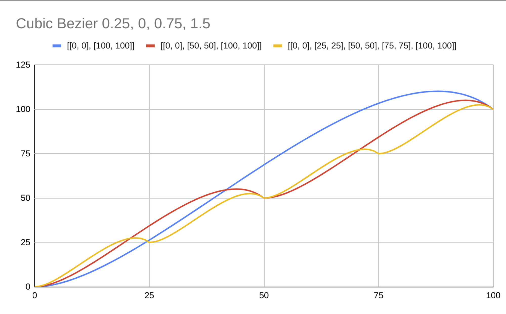

# Cubic Bezier

`{ "cubicbezier": [number, number, number, number, Stops[]] }`: Interpolates using the bezier curve defined by the curve control points.

The following images shows the behaviour of this definition

```
{ "cubicbezier": [0.25, 0, 0.75, 1.5, [[0, 0], [100, 100]]]} // Blue
{ "cubicbezier": [0.25, 0, 0.75, 1.5, [[0, 0], [50, 50], [100, 100]]} // Red
{ "cubicbezier": [0.25, 0, 0.75, 1.5, [[0, 0], [25, 25], [50, 50], [75, 75], [100, 100]]} // Yellow
```


