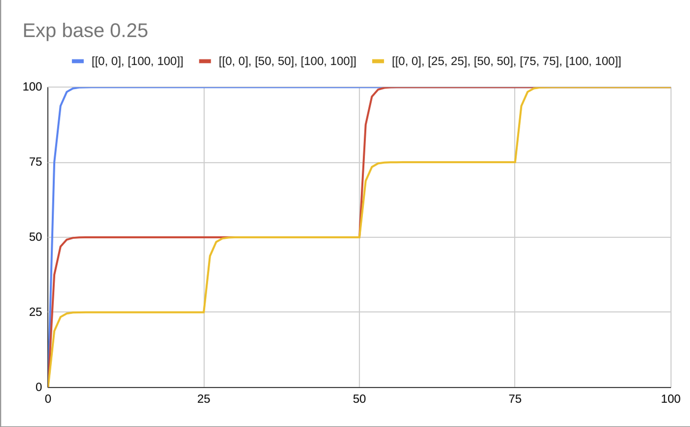
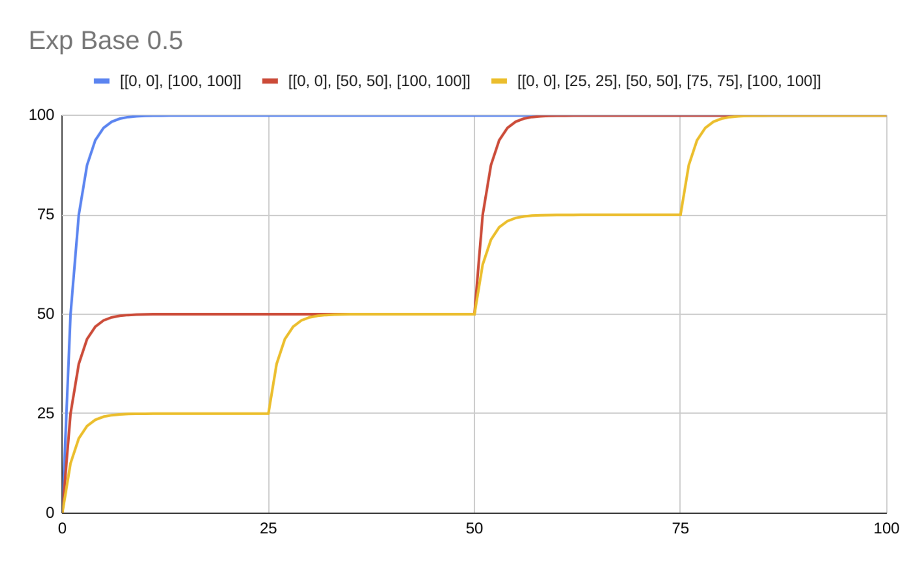
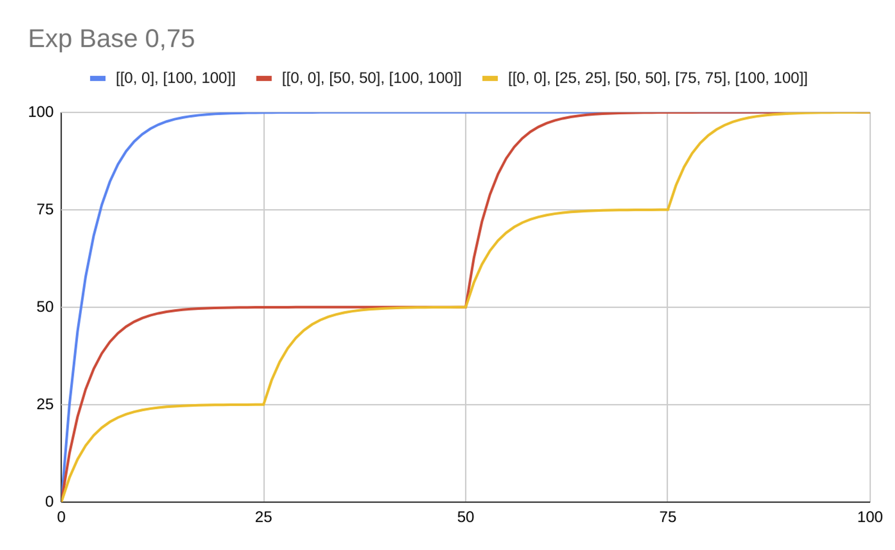
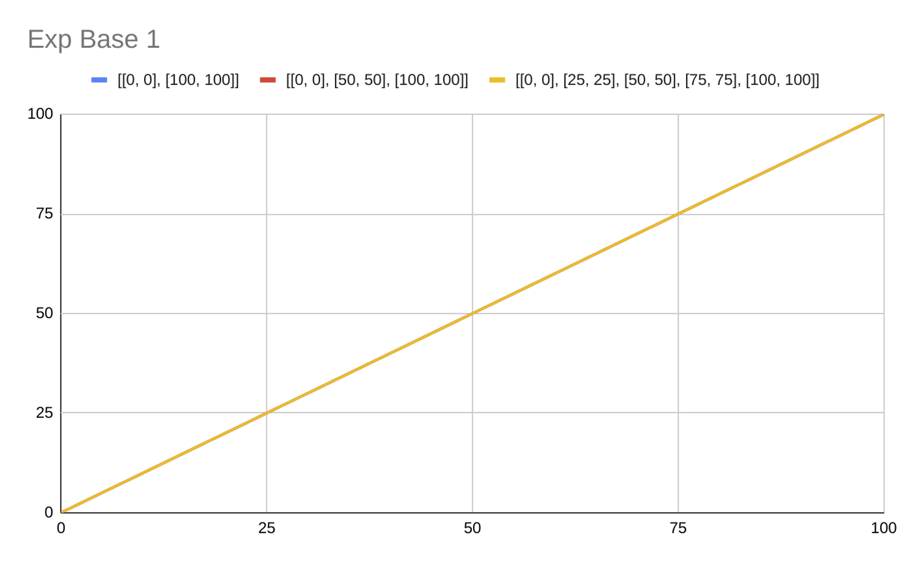
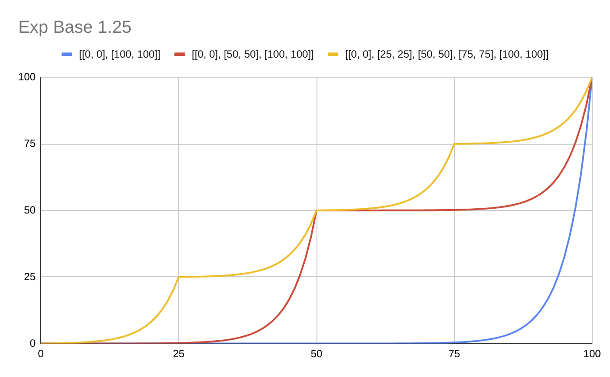
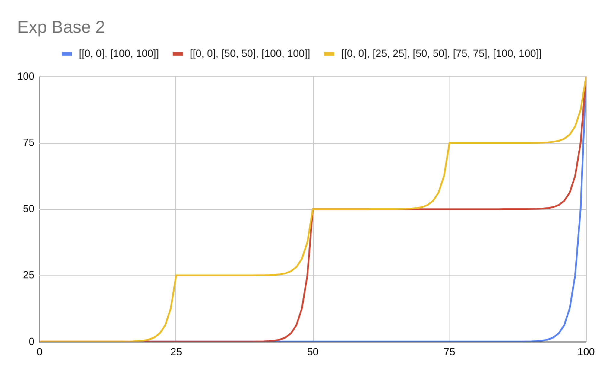

# Exponential

`{ "exp": [number, Stops[]] }`: Exponentially interpolates between output stop values less than or equal and greater than the input value. The base parameter controls the rate at which output increases where higher values increase the output value towards the end of the range, lower values increase the output value towards the start of the range, and a base 1 interpolates linearly.

The used value is computed as follows : `(Math.pow(base, progress) - 1) / (Math.pow(base, difference) - 1)`

```
{
  "exp": [
    0.25,
    [
      [0, 25],
      [10, 100]
    ]
  ]
}
// If zoom level is less than 0, 25 is returned
// If zoom level z is between 0 and 10, an interpolation factor is computed between 0 and 10
// and then it's used to interpolate between 25 and 100
// If zoom level is equal or higher than 10, 100 will be returned
```

The following images shows the behaviour of this definition

```
{ "exp": [0.25, [[0, 0], [100, 100]]]} // Blue
{ "exp": [0.25, [[0, 0], [50, 50], [100, 100]]]} // Red
{ "exp": [0.25, [[0, 0], [25, 25], [50, 50], [75, 75], [100, 100]]]} // Yellow
```



```
{ "exp": [0.5, [[0, 0], [100, 100]]]} // Blue
{ "exp": [0.5, [[0, 0], [50, 50], [100, 100]]]} // Red
{ "exp": [0.5, [[0, 0], [25, 25], [50, 50], [75, 75], [100, 100]]]} // Yellow
```



```
{ "exp": [0.75, [[0, 0], [100, 100]]]} // Blue
{ "exp": [0.75, [[0, 0], [50, 50], [100, 100]]]} // Red
{ "exp": [0.75, [[0, 0], [25, 25], [50, 50], [75, 75], [100, 100]]]} // Yellow
```



```
{ "exp": [1, [[0, 0], [100, 100]]]} // Blue
{ "exp": [1, [[0, 0], [50, 50], [100, 100]]]} // Red
{ "exp": [1, [[0, 0], [25, 25], [50, 50], [75, 75], [100, 100]]]} // Yellow
```



```
{ "exp": [1.25, [[0, 0], [100, 100]]]} // Blue
{ "exp": [1.25, [[0, 0], [50, 50], [100, 100]]]} // Red
{ "exp": [1.25, [[0, 0], [25, 25], [50, 50], [75, 75], [100, 100]]]} // Yellow
```



```
{ "exp": [2, [[0, 0], [100, 100]]]} // Blue
{ "exp": [2, [[0, 0], [50, 50], [100, 100]]]} // Red
{ "exp": [2, [[0, 0], [25, 25], [50, 50], [75, 75], [100, 100]]]} // Yellow
```




