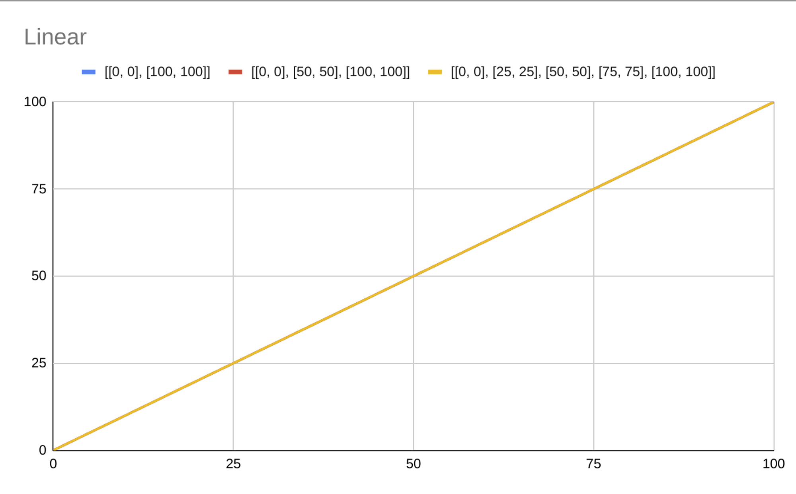

# Linear

`{ "linear": Stops[] }`: Linearly interpolates between stop values less than or equal and greater than the input value

```{
  "linear": [
    [8, 10],
    [14, 15],
    [20, 21]
  ]
}
// If zoom level is less than 8, 10 is returned
// If zoom level is greater or equal than 8 but less than 14, a value linearly interpolated
// between 10 and 15 is returned
// If zoom level is greater or equal than 14 but less than 20, a value linearly interpolated // between 15 and 21 is returned
// If zoom level is greater or equal than 20, 21 is returned
```

The following image shows the behaviour of this definitions

```
{ "linear": [[0, 0], [100, 100]]} // Blue
{ "linear": [[0, 0], [50, 50], [100, 100]]} // Red
{ "linear": [[0, 0], [25, 25], [50, 50], [75, 75], [100, 100]]} // Yellow
```



`{ "linear": [number, number] }`: Expands to `{ "linear": [[minZoom, number], [maxZoom, number] }`

```
{ "linear": [8, 10] }
// If minZoom is defined as 3 and maxZoom is defined as 20:
// If zoom level is less than 3, 8 is returned
// If zoom level is between 3 and 20, a value linearly interpolated between 8 and 10 is
// returned
// If zoom level is greater or equal than 20, 10 is returned
```