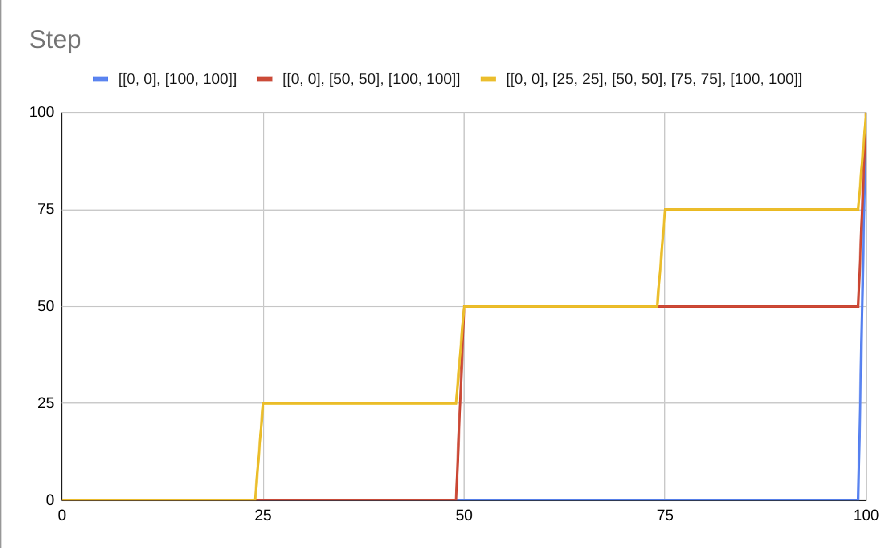

# Step

`{ "step": [output0, Stops[]] }`: Computes discrete results by evaluating a piecewise-constant function defined by stops on a given input. Returns the output value of the stop with a stop input value just less than the input one. If the input value is less than the input of the first stop, `output0` is returned.

Stops are defined as pairs of `[zoom, value]` where `zoom` is the minimum zoom level where `value` is returned and `value` can be `number | string | boolean`. Note that stops need to be defined by increasing zoom level.

```
{ "step": ["hsl(50,5%,72%)", [[9, "hsl(10,75%,75%)"]] }
// If zoom level is less than 9, "hsl(50,5%,72%)" will be returned
// If zoom level is equal or higher than 9, "hsl(10,75%,75%)" will be returned
```

The following image shows the behaviour of this definitions

```
{ "step": [0, [[0, 0], [100, 100]]]} // Blue
{ "step": [0, [[0, 0], [50, 50], [100, 100]]]} // Red
{ "step": [0, [[0, 0], [25, 25], [50, 50], [75, 75], [100, 100]]]} // Yellow
```


