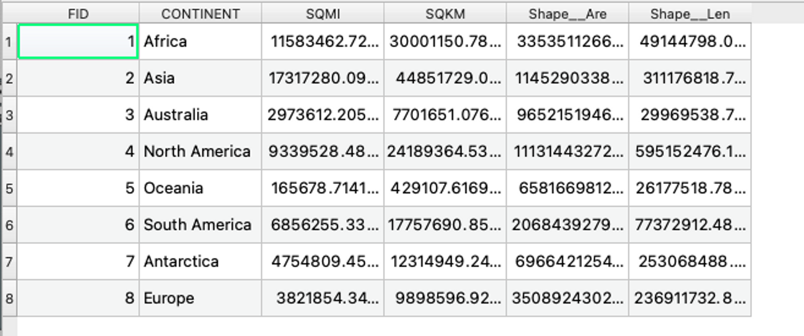
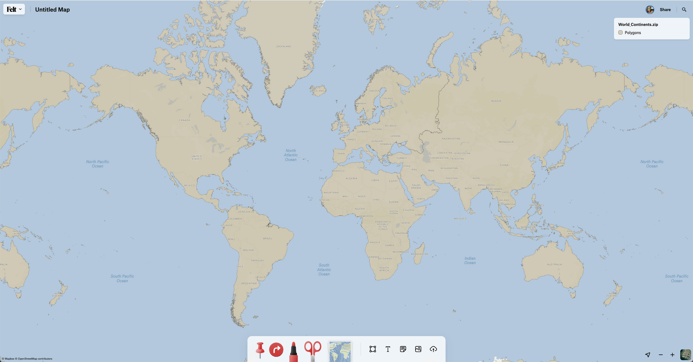
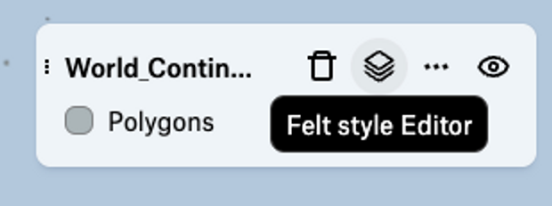

# Category Map of Continents 

A category map applies different visual styles to distinct types in a categorical attribute. This example shows how to use the `categorical` visualization type with the Style Editor.

In this example, we’ll walk through the steps to make a categorical map of World Continents.

<iframe width="100%" height="450" frameborder="0" title="Felt Map" src="https://felt.com/embed/map/Continents-copy-wEEVKBMgTt6s29ByNLqCfKD?lat=37.393034&lon=-113.166749&zoom=4.3270239562525985"></iframe>

**Getting started:**

<li>
Download this zipped shapefile of continents
</li>
World_Continents.zip TODO
<li>
Add it to a Felt map
</li>

Looking at the attribute table: there is a field for CONTINENT which is what we will use to color each continent’s shape with a unique color.



**Open the Style Editor to explore the default style**

Once your data has uploaded to Felt, you will see the continents draw with a single random color assigned to all features in the dataset:



To see the Markup applied to the this dataset, click the Layer icon next to the dataset’s name to open the Felt Style Editor: 

To see the style that is applied, click on the option to open the Felt Style Editor




```
{
  "datasets": [{"id": "bbad97f5-2074-4d0f-9819-a20e689c19e1"}],
  "version": "2.0-RC1",
  "visualizations": [
    {
      "dataset": "bbad97f5-2074-4d0f-9819-a20e689c19e1",
      "type": "categorical",
      "config": {
        "attribute": "CONTINENT",
        "categories": ["Africa", "Asia", "Australia", "North America", "Oceania", "South America", "Antarctica", "Europe"]
      },
      "style": {
        "color":  ["#D9BDA9","#EDB498","#D19ECB","#FAE496","#BCCC7A","#9AA5DF","#AC9ED1","#fcb67f"],
        "opacity": 0.6,
        "showAboveBasemap": true,
        "strokeColor": ["#D9BDA9","#EDB498","#D19ECB","#FAE496","#BCCC7A","#9AA5DF","#AC9ED1","#fcb67f"],
        "strokeWidth": 2
      },
      "label": {
        "color": "#333333",
        "fontSize": 14,
        "fontStyle": "Normal",
        "fontWeight": 400,
        "haloColor": "#d0d0d0",
        "labelAttribute": ["CONTINENT"],
        "minZoom": 3
      },
      "legend": {"displayName": "Polygons"}
    }
  ]
}
```


