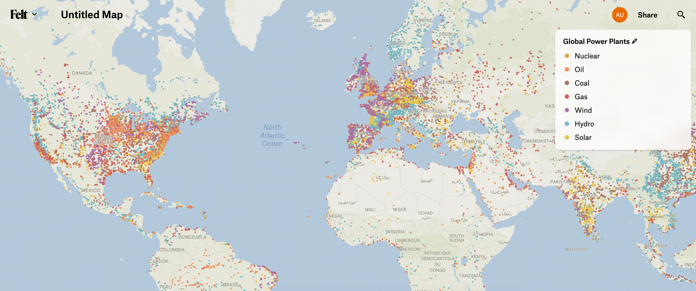

# Categorical visualizations

Categorical visualizations define a categorical attribute and a set of values to apply to each one of the different values of that attribute.

Categorical visualizations must define `“type”: “categorical”` and, for every style and label properties used, either a single value that will apply to all categories or an array of different values for each category.

The Global Power Plants layer in Felt is an example of a categorical layer



and is defined with the following visualization block

```
{
	"type": "categorical",
	"config": {
		"showOther": true,
		"labelAttribute": ["name"],
    "categoricalAttribute": "primary_fuel",
    "categories": [
      "Nuclear",
      "Oil",
      "Coal",
      "Gas",
      "Wind",
      "Hydro",
      "Solar"
    ]
  }
	"style": {
    "color": [
      "#DEA145",
      "#EB9360",
      "#AD7B68",
      "#CC615C",
      "#AB71A4",
      "#7AB6C2",
      "#E5C550"
    ],
    "size": 5,
    "strokeColor": [
      "#FAD398",
      "#FFC8A8",
      "#C7A395",
      "#F1B3B0",
      "#EBD3E8",
      "#A3D6E0",
      "#F2DB85"
    ]
  },
  "label": {
		"minZoom": 9,
    "color": [
      "#DEA145",
      "#DE7D45",
      "#946E59",
      "#CC615C",
      "#AB71A4",
      "#5B99A6",
      "#CCA929"
    ],
    "haloColor": [
      "#F2E4CE",
      "#F2E8C2",
      "#F2E9E4",
      "#FAE2E1",
      "#F7E4F5",
      "#D8ECF0",
      "#F2E8C2"
    ],
    "offset": [8, 0],
  },
  "legend": {},
}
```

Notice that we are saying that the `primary_fuel` data attribute will be used to categorize elements and that the possible values of that attribute that we are interested in are `"Nuclear"`, `"Oil"`, `"Coal"`, `"Gas"`, `"Wind"`, `"Hydro"` and `"Solar"`. Also notice that we are defining either a single value that will apply to all categories (i.e. `size` and `offset`) or a value for each category (i.e. `color`)