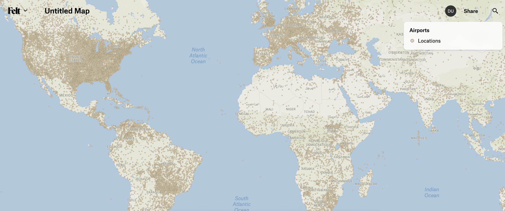

# Simple visualizations

Simple visualizations are those that show each feature in a dataset using the same style.

Simple visualizations must define `“type”: “simple”` and a single value for each style and label properties.

The Airports layer in Felt is an example of a simple visualization



and is defined with the following visualization block

```
{
	"type": "simple",
	"config": {"labelAttribute": ["name_en", "name"]},
	"style": {
    "color": "hsl(40,30%,80%)",
    "strokeColor": "hsl(40,20%,55%)",
    "strokeWidth": 1
  },
  "label": {
		"minZoom": 10,
    "color": "hsl(40,30%,40%)",
    "fontSize": 15,
    "haloColor": "hsl(40,20%,85%)",
    "offset": [8, 0],
  },
  "legend": {"displayName": "Locations"}
}
```


