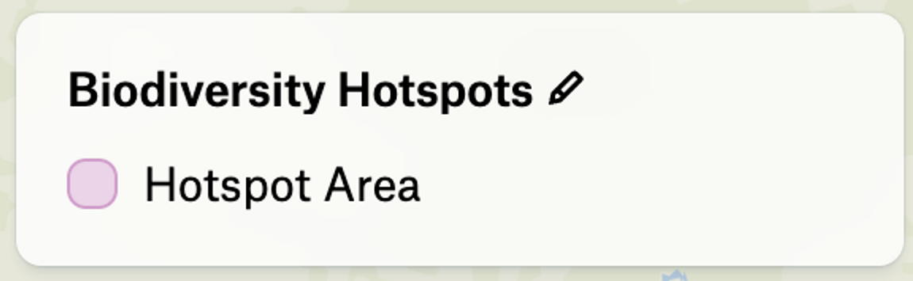
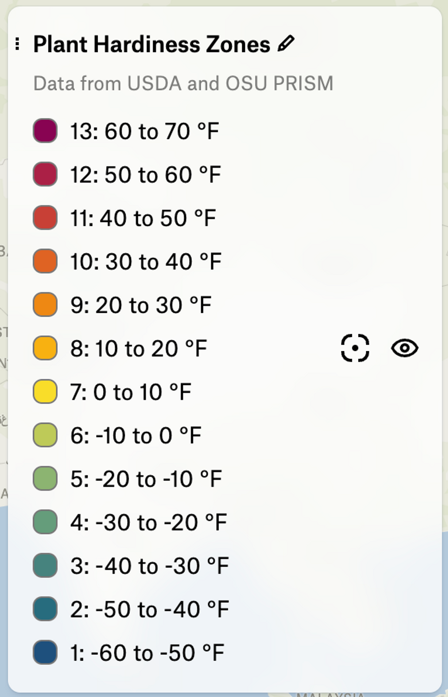

# Legends

Adding a legend block to a visualization makes a legend entry appear for this visualization.

Each legend entry is shown with the geometry type and color defined by the dataset and the visualization block.

While simple visualizations will generate a single legend entry, categorical visualizations will generate a legend entry per category.
To see how a legend is defined, take a look at the [legend block section](https://www.notion.so/Felt-Style-Language-0f4de46f0cf2450ea2a19853741097d6).

The Biodiversity Hotspots layer in Felt has a simple visualization with a legend defined as follows:



```
"legend": {"displayName": "Hotspot Area"}
```

The Plant Hardiness Zones layer in Felt has a categorical visualization with a legend defined as follows:



```"legend": {
  "displayName": {
		"13": "13: 60 to 70 °F",
		"12": "12: 50 to 60 °F",
		"11": "11: 40 to 50 °F",
		"10": "10: 30 to 40 °F",
		"9": "9: 20 to 30 °F",
		"8": "8: 10 to 20 °F",
		"7": "7: 0 to 10 °F",
		"6": "6: -10 to 0 °F",
		"5": "5: -20 to -10 °F",
		"4": "4: -30 to -20 °F",
		"3": "3: -40 to -30 °F",
		"2": "2: -50 to -40 °F",
    "1": "1: -60 to -50 °F"
  },
  "subtitle": "Data from USDA and OSU PRISM"
}
```

Categorical legend example. Notice how it's mapping from categories to displayed names.
